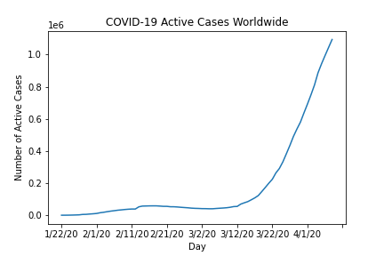

# COVID-19-Visualizations
Visualizations of the novel coronavirus using data science and machine learning techniques. Please feel free to contribute by sending issues or pull requests. I will do my best effort to update this daily. There is a lot of reading and writing of data involved, so the notebook tends to take around 10 minutes to completely run.

_Stay Strong, Stay Home, and Save Lives_

## Dependencies
This project uses Pandas, NumPy, MatPlotLib, GeoPandas, and Descartes. All the code needed to run is in `COVID19 Visualizations.ipynb`. Please make sure you have installed the all the Python libraries before you run the code. Also make sure to install `ffmpeg` if you want to compile graphics into video.

# Core Functions

## `country(country_name, data)`
Displays the graphs of a country associated with the type of data (confirmed, deaths, or recovered)

## `country_legend(country_name)`
Displays the graphs of all the types of data for a given country

## `customCountries(list_countries)`
Displays the all graph for a list of given countries. All on top of each other for comparison of statistics.

## `country_active_cases(country_name)`
Displays the graph of active cases of COVID-19 for a given country. Calculated by `active = confirmed - deaths - recovered`

# Update Functions

## `updateAllCountryGraphs()`
Updates/overwrites all the graphs by country and data type (confirmed, deaths, recovered) in the `graphs_by_countries/` directory.

## `updateAllCountryGraphsLegend()`
Updates/overwrites all the graphs by country and all data types in the `graphs_by_countries_legend/` directory

## `updateAllCountryActiveCases()`
Updates/overwrites all the graphs of active cases by country in the `active_cases/` directory

# Global Statistics

