# COVID-19 Visualizations
Visualizations of the novel coronavirus using data science and machine learning techniques. Please feel free to contribute by sending issues or pull requests. I will do my best effort to update this daily. There is a lot of reading and writing of data involved, so the notebook tends to take around 30 minutes to completely run a fresh copy of the notebook. Apoligies in advanced if this causes your browser to crash because of high RAM usage (Runs okay on my machine with 8GB of RAM and in Chrome). At the time of making this project, I have never formally studied data science or machine learning yet, so feedback is much appreciated. I was able to build this project through extensive documentation reading of the data science and machine learning packages, and I may be missing more efficient ways to run my code.

**If your intentions are to use this for a school project or personal project, please star or fork this repository and email [briancpark@berkeley.edu](mailto:briancpark@berkeley.edu). I am interested in what you are willing to create or have created with my code or visualizations**

_Stay Strong, Stay Home, and Save Lives_

## Contents
* [Daily Report](#1)
* [Code Documentation](#2)
* [Visualizations](#3)
* [Data Sources](#3)
* [Other Resources](#3)

## COVID-19 Daily Report and Data Analysis 
**This will be updated bidaily. Watch or star for the latest updates!**

### COVID-19 Worldwide Cases
Cases are still rising alarmingly high. Cases have surpassed over 4 million. Over 1.5 million have recovered and over 100,000 have died from the novel coronavirus.

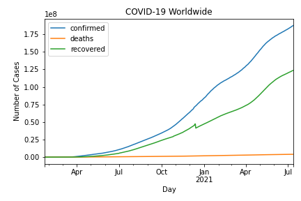

### COVID-19 Active Cases Worldwide
Cases are about to hit 2.5 million. As many countries and government have started and extended lockdowns, number of active cases are starting to slowly grow and the curve is starting to flatten.

### Where It All Began (China)
China started lockdowns on January 23rd. China's effective lockdown measures have resulted in a good recovery. China has slowly started going back to normal life, while still taking precautions of a second wave. As of May 11th, 2020, China has reported a [new cluster](https://edition.cnn.com/2020/05/11/asia/china-south-korea-coronavirus-reopening-intl-hnk/index.html) of virus, since the lifting of the lockdown.

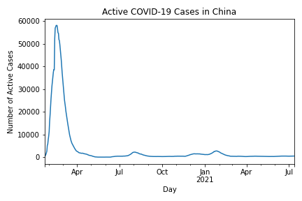

### South Korea's Quick Response with Contact Tracing and Extensive Testing
South Korea's quick reponse and preparedness due to their previous experience with [MERS in 2015](https://en.wikipedia.org/wiki/2015_Middle_East_respiratory_syndrome_outbreak_in_South_Korea) showed success in handling the coronavirus without having a major lockdown through extensive testing and contact tracing. They were able to effectively keep under 10,000 active cases.

### The Last of US
Level of disorganized and opposing views of public health has caused economies to shut down during lockdowns and not take the virus to serious measures. *Note: I chose to max out confirmed cases by county to 1000 people and deaths to 100 people. I believe that 1000 people infected in a local county is alarming, and the same case for 100 people who died from COVID-19 in a county. I'm trying to point out the severity of the spread of COVID-19 rather than the number of cases, which a line graph does a much better job at*

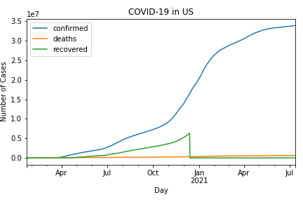
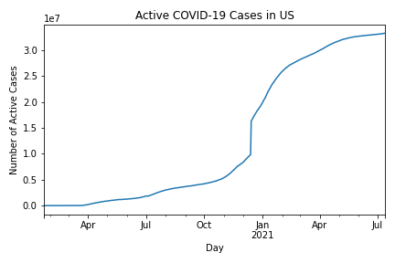

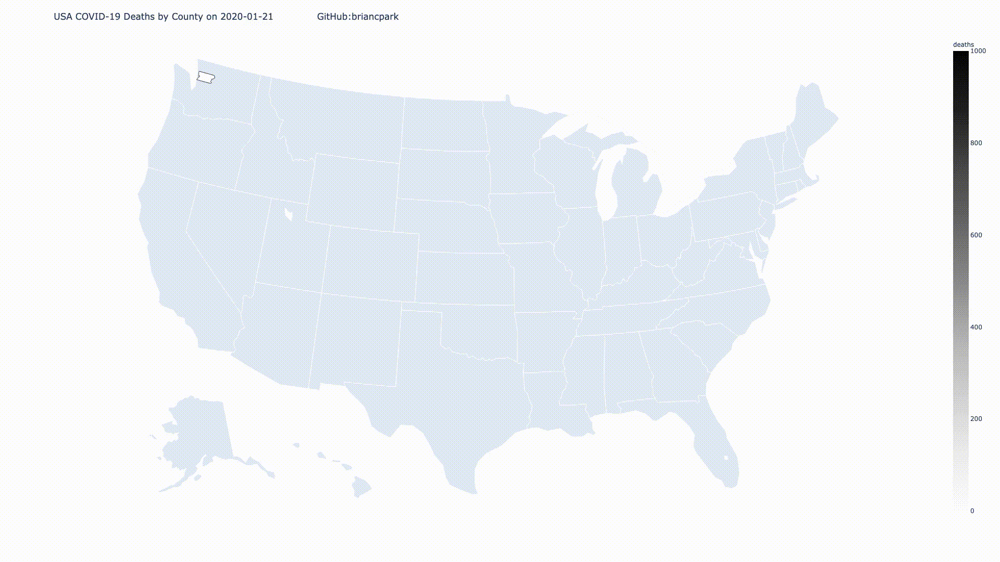

### "The Coronavirus Wave"
The novel coronavirus has spread westward and the US will probably be the latest to recover fully based on the data and statistics. Eastern Asia also have to take serious precautions for a second wave, which could lead to another "coronavirus wave" westwards.

### So... How Bad is it Over Here?
Showcasing the top 5 highest COVID-19 cases by states.

#### New York
New York city has it the worst with over 300,000 cases, but curve is being slowly flattened because of the lockdown that started in [March 22nd](https://www.theguardian.com/world/video/2020/mar/23/manhattan-streets-empty-as-new-york-city-goes-into-coronavirus-lockdown-video).

#### New Jersey

#### Massachusetts

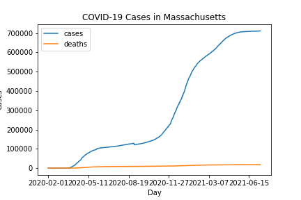

#### Illinois

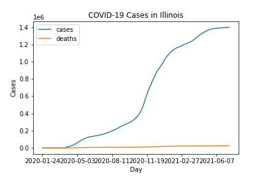

#### California
LA area is spreading more and more rapidly, as well as the Bay Area. Internships and jobs are being cancelled or remote for many of the big tech companies. Following the "coronavirus wave" concept, California may very well be the last state to recover fully from this epidemic.

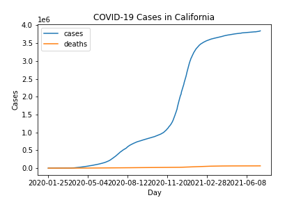

# Using Data Science and Machine Learning to Code the Coronavirus 
This next section is devoted to explaining how the code works.

## Dependencies
This project uses Pandas, NumPy, MatPlotLib, GeoPandas, and Descartes, plotly, and Selenium. All the code needed to run is in [`COVID19 Visualizations.ipynb`](https://github.com/briancpark/COVID-19-Visualizations/blob/master/COVID19%20Visualizations.ipynb). Please make sure you have installed the all the Python libraries before you run the code. Also make sure to install `ffmpeg` if you want to compile graphics into video.

## Databases
[NYTimes](https://github.com/nytimes/covid-19-data) database was used for United States of America data and [JHU CSSE](https://github.com/CSSEGISandData/COVID-19) database was used for international data. Repository is updated bidaily as both databases update around 12 hours apart. Notebook is conveniently coded with UNIX commands so that all it takes to update the visualizations is a simple restart and rerun of the kernel.

## Core Functions

## `country(country_name, data)`
Displays the graphs of a country associated with the type of data (confirmed, deaths, or recovered)

## `country_legend(country_name)`
Displays the graphs of all the types of data for a given country

## `country_active_cases(country_name)`
Displays the graph of active cases of COVID-19 for a given country. Calculated by `active = confirmed - deaths - recovered`

## `compare_countries(list_countries)`
Displays the all graph for a list of given countries. All on top of each other for comparison of statistics.

# Update Functions

## `update_all_cases_country_individual()`
Updates/overwrites all the graphs by country and data type (confirmed, deaths, recovered) in the `cases_country_individual/` directory.

## `update_all_cases_country()`
Updates/overwrites all the graphs by country and all data types in the `cases_country/` directory

## `update_all_cases_country_active()`
Updates/overwrites all the graphs of active cases by country in the `cases_country_active/` directory

# Global Statistics

## `worldwide_cases()`
Updates/overwrites the worldwide COVID-19 cases. Saved in the main directory as `COVID19_worldwide.png`

## `worldwide_active()`
Updates/overwrites the worldwide COVID-19 active cases. Saved in the main directory as `COVID19_worldwide_active.png`

# Geo Functions
These functions utilize the GeoPandas library to visualize COVID-19 cases on the map.

## `compile_timelapse()`
Uses `ffmpeg` to compile into video and gif format.

# Visualizations 

## Timelapses

### Confirmed COVID-19 Cases Worldwide

### Deaths from COVID-19 Worldwide

### Recovered COVID-19 Cases Worldwide

### Confirmed COVID-19 Cases by County in United States

### COVID-19 Deaths by County in United States

### US Citizens Who Always Wears Masks
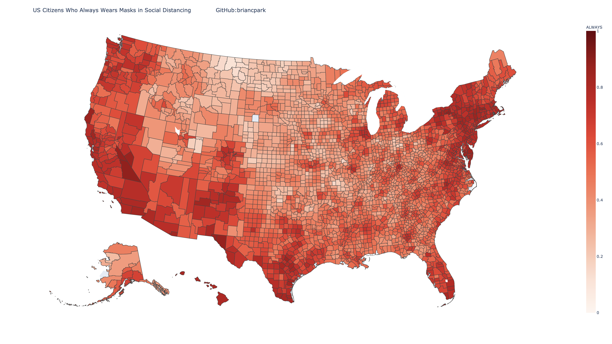
### US Citizens Who Always Wears Masks

### US Citizens Who Always Wears Masks
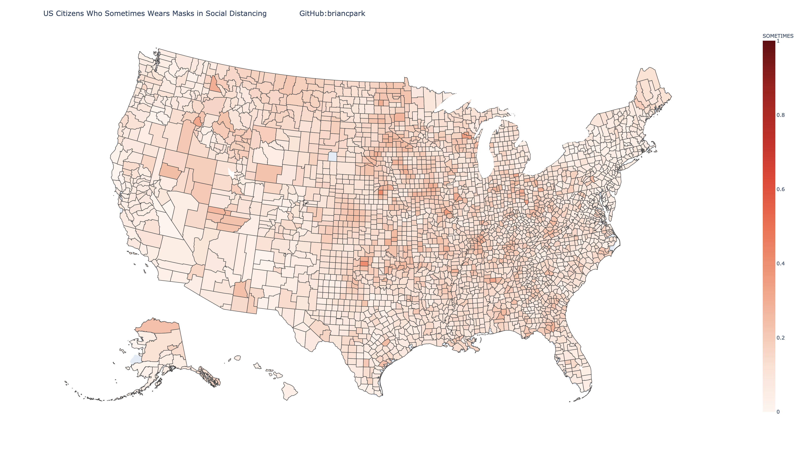
### US Citizens Who Always Wears Masks
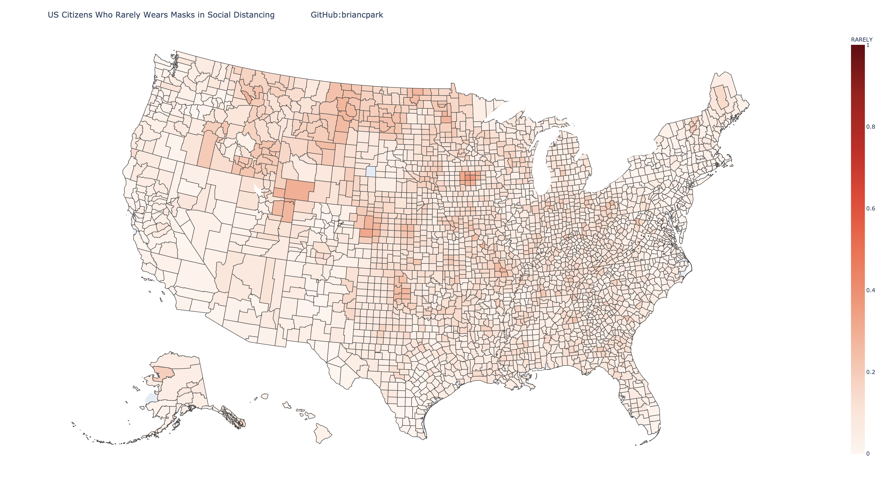
### US Citizens Who Always Wears Masks
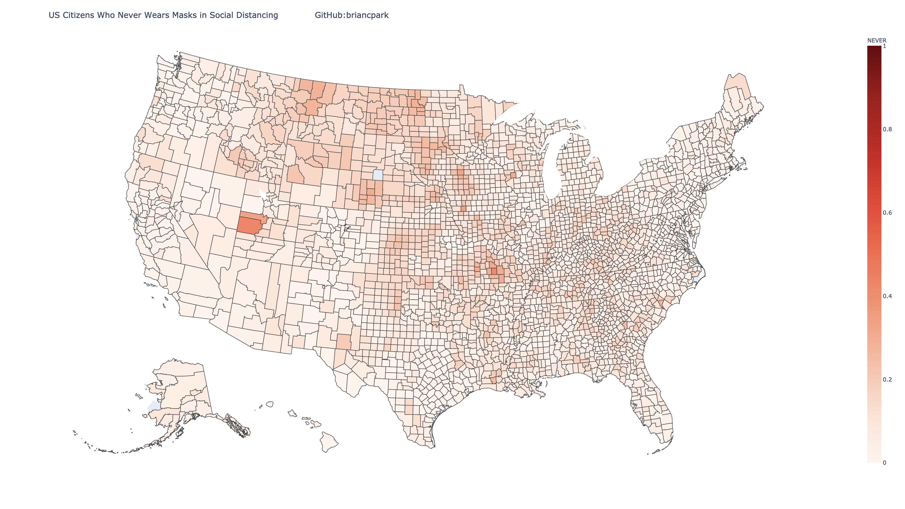

# Data Sources 
I used the dataset provided by the [NYTimes](https://github.com/nytimes/covid-19-data). Although the dataset provided by JHU CSSE provides international data, the NYTimes has more specific metadata that is useful in analyzing the United States data like coronavirus cases by states and cities. COVID-19 cases are rising dangerously high in United States at the time of writing this. The NYTimes has already displayed useful [statistics](https://www.nytimes.com/interactive/2020/us/coronavirus-us-cases.html) with their own database, but I decided to take it one step further and implement time factor.

# Other Resources 
[World Meters Coronavirus Tracker](https://www.worldometers.info/coronavirus/)
