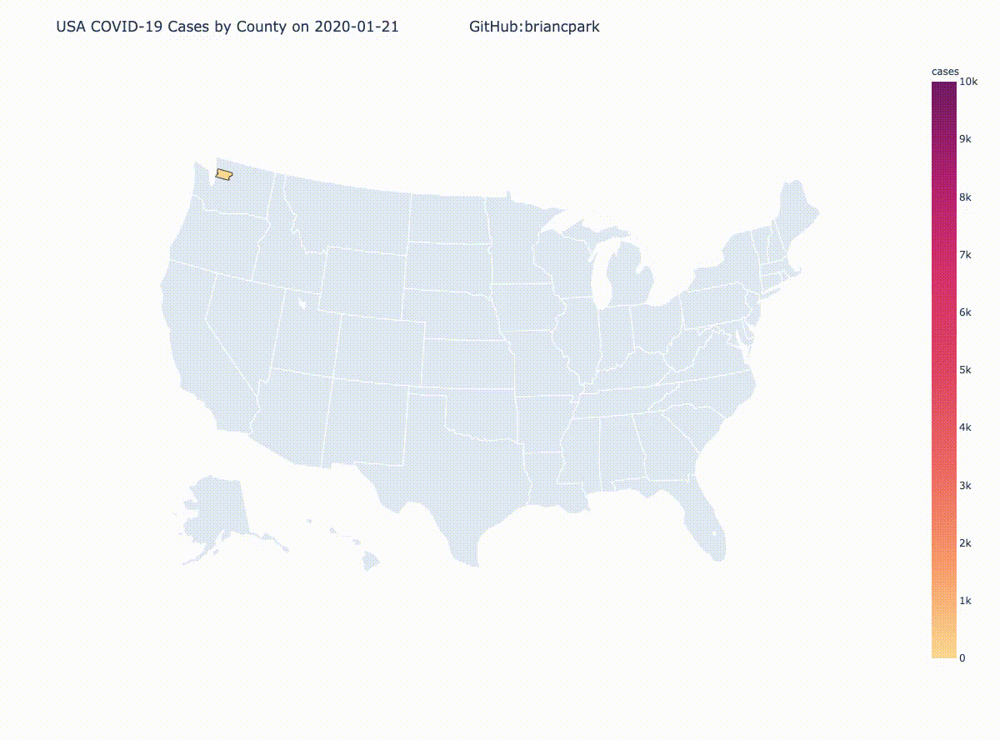
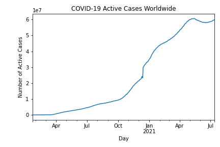

# COVID-19-Visualizations
Visualizations of the novel coronavirus using data science and machine learning techniques. Please feel free to contribute by sending issues or pull requests. I will do my best effort to update this daily. There is a lot of reading and writing of data involved, so the notebook tends to take around 10 minutes to completely run. At the time of making this project, I have never formally studied data science or machine learning yet, so feedback is appreciated. I was able to build this project through extensive documentation reading of the data science and machine learning packages, and I may be missing more efficient ways to run my code.

**If your intentions are to use this for a school project or personal project, please fork this repository and email [briancpark@berkeley.edu](mailto:briancpark@berkeley.edu). I am interested in what you are willing to create or have created with my code**

_Stay Strong, Stay Home, and Save Lives_

## Dependencies
This project uses Pandas, NumPy, MatPlotLib, GeoPandas, and Descartes, plotly, and Selenium. All the code needed to run is in [`COVID19 Visualizations.ipynb`](https://github.com/briancpark/COVID-19-Visualizations/blob/master/COVID19%20Visualizations.ipynb). Please make sure you have installed the all the Python libraries before you run the code. Also make sure to install `ffmpeg` if you want to compile graphics into video.

# Core Functions

## `country(country_name, data)`
Displays the graphs of a country associated with the type of data (confirmed, deaths, or recovered)

## `country_legend(country_name)`
Displays the graphs of all the types of data for a given country

## `country_active_cases(country_name)`
Displays the graph of active cases of COVID-19 for a given country. Calculated by `active = confirmed - deaths - recovered`

## `compare_countries(list_countries)`
Displays the all graph for a list of given countries. All on top of each other for comparison of statistics.

# Update Functions

## `update_all_cases_country_individual()`
Updates/overwrites all the graphs by country and data type (confirmed, deaths, recovered) in the `cases_country_individual/` directory.

## `update_all_cases_country()`
Updates/overwrites all the graphs by country and all data types in the `cases_country/` directory

## `update_all_cases_country_active()`
Updates/overwrites all the graphs of active cases by country in the `cases_country_active/` directory

# Global Statistics

## `worldwide_cases()`
Updates/overwrites the worldwide COVID-19 cases. Saved in the main directory as `COVID19_worldwide.png`

## `worldwide_active()`
Updates/overwrites the worldwide COVID-19 active cases. Saved in the main directory as `COVID19_worldwide_active.png`

# Geo Functions
These functions utilize the GeoPandas library to visualize COVID-19 cases on the map.

## `compile_timelapse()`
Uses `ffmpeg` to compile into video and gif format.

# Timelapses
timelapses/us_confirmed_timelapse.gif
## Confirmed COVID-19 Cases Worldwide

## Deaths from COVID-19 Worldwide

## Recovered COVID-19 Cases Worldwide

## Confirmed COVID-19 Cases by County in United States

# COVID-19 Cases in the United States of America
I used the dataset provided by the [NYTimes](https://github.com/nytimes/covid-19-data). Although the dataset provided by JHU CSSE provides international data, the NYTimes has more specific metadata that is useful in analyzing the United States data like coronavirus cases by states and cities. COVID-19 cases are rising dangerously high in United States at the time of writing this. The NYTimes has already displayed useful [statistics](https://www.nytimes.com/interactive/2020/us/coronavirus-us-cases.html) with their own database, but I decided to take it one step further and implement time factor.

*Need to fix bugs related to gif compression*

*A more cleaner `.mp4` video version is downloadable [here](geo/geo_us/us_cases_timelapse.mp4)*
